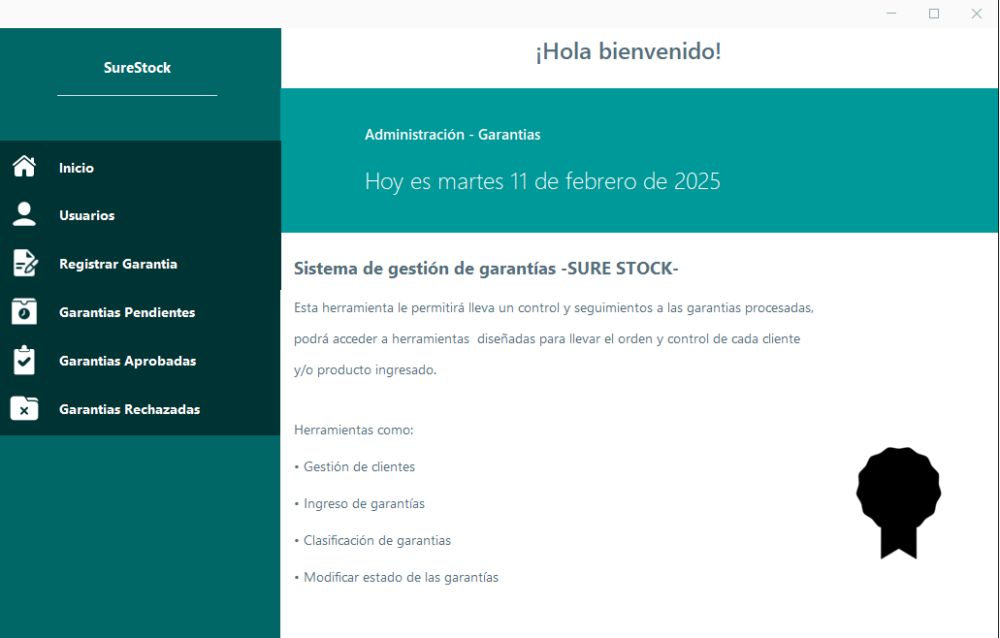
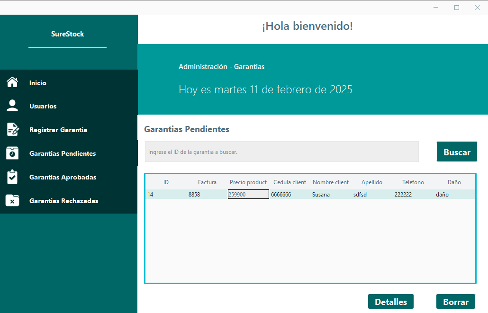

# Warranty management system

**SureStock** This tool will allow you to control and monitor the processed guarantees, 
you will be able to access tools designed to keep order and control of each client or product entered.

This project was developed in **Java** implementing jswing as a graphical interface, an intuitive and visually pleasing interface, data is stored locally using **MySQL Workbench**

## Screenshots

## Features

- **Customer management:** register, modify and delete customer data that is stored in the database
- **Warranty registration:** warranty registration, validate that the client exists to be able to associate the warranty that is going to be registered and thus store the information
- **Warranty classification:** guarantees are classified from pending to "approved" or "rejected"

## Tech Stack

**Frontend:** Java Swing

**Database:** MySQL-Workbench

